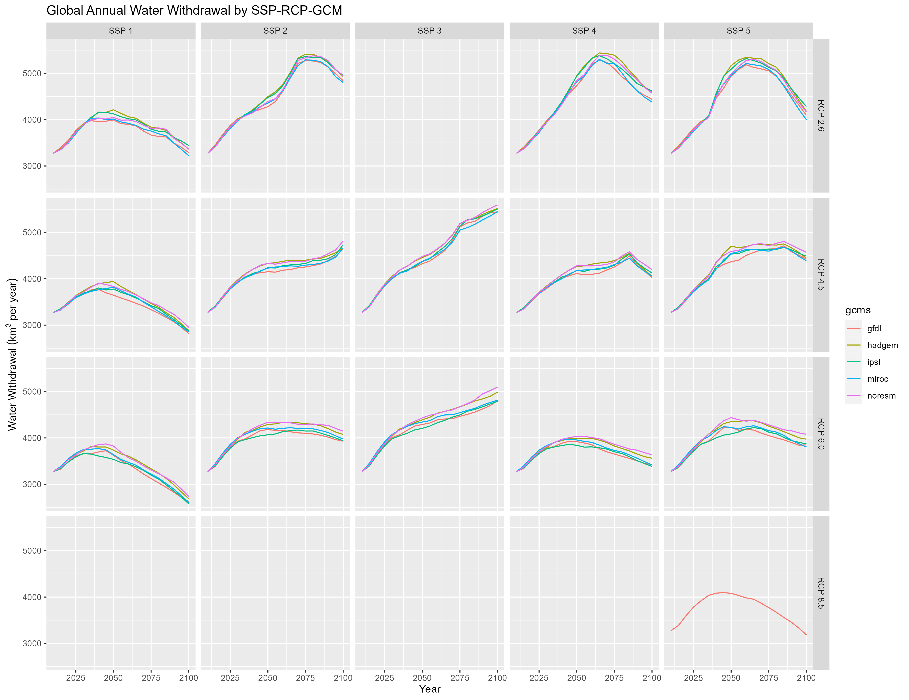

<!-------------------------->
<!-------------------------->
# Citation
<!-------------------------->
<!-------------------------->
<p align="center"> </p>

Khan, Z., Thompson, I., Vernon, C., 2022. A global gridded monthly water withdrawal dataset for multiple sectors from 2015 to 2100 at 0.5° resolution under a range of socioeconomic and climate scenarios. (In progress) Journal_TBD, DOI: XXXX

<!-------------------------->
<!-------------------------->
# Models Used
<!-------------------------->
<!-------------------------->
<p align="center"> </p>

```{r, results = 'show', eval=TRUE, echo=FALSE, warning=FALSE, error = FALSE, message = FALSE}
library(kableExtra)
data.frame(
    Model     = c("WRF",
                  "GCAM",
                  "Xanthos",
                  "Helios",
                  "GGCMI",
                  "rpackageutils",
                  "im3components",
                  "gcamextractor"),
    Version = c("-",
                "gcam v5.3 (branch gcam-usa-im3)",
                "xanthos v2.4.1",
                "helios v1.0.0",
                "ggcmi v1.0.0",
                "rpackageutils v1.0.0",
                "im3components v1.0.0",
                "gcamextractor"),
    Description = c("Climate simulation model",
                    "Global Change Analysis Model. Human-earth systems dynamic model.",
                    "Water runoff emulator at 0.5 degree grids and monthly timesteps.",
                    "Gridded Heating and cooling degree day calculator at multiple spatial and temporal resolution.",
                    "Emulators to model agricultural yield impacts in response to climate",
                    "Utility functions to process, aggregate and reformat data.",
                    "Functions to process data between different IM3 models.",
                    "Model to extract and process data from GCAM output databases."),
    Language = c("-",
                  "C++/R",
                  "Python",
                  "R",
                  "?",
                  "R",
                  "R/Python",
                  "R"),
    Link = c("https://www.mmm.ucar.edu/weather-research-and-forecasting-model",
             "https://stash.pnnl.gov/projects/JGCRI/repos/gcam-core/browse?at=refs%2Fheads%2Fzk%2Ffeature%2Fgcam-usa-im3",
            "https://github.com/JGCRI/xanthos",
            "Helios",
            "GGCMI",
            "https://github.com/JGCRI/rpackageutils",
            "https://github.com/IMMM-SFA/im3components",
            "https://github.com/JGCRI/gcamextractor")
    ) %>% 
  kbl() %>%
  kable_styling(bootstrap_options = c("striped", "hover", "condensed", "responsive"))

```


<!-------------------------->
<!-------------------------->
# Data
<!-------------------------->
<!-------------------------->
<p align="center"> </p>

```{r, results = 'show', eval=TRUE, echo=FALSE, warning=FALSE, error = FALSE, message = FALSE}
library(kableExtra)
data.frame(
    Data     = c("WRF Outputs",
                 "Xanthos Outputs",
                 "Helios Outputs",
                 "GGCMI Outputs",
                 "Population US States",
                 "Population Gridded",
                 "GCAM Outputs"),
     Source = c("WRF runs",
                "Xanthos runs (Workflow 1)",
                "Helios runs (Workflow 2)",
                "GGCMI runs (Workflow 3)",
                "xxx",
                "xxx",
                "GCAM runs (Workflow 7)"),
    `Used by` = c("Xanthos, Helios, GGCMI",
                  "GCAM",
                  "GCAM",
                  "GCAM",
                  "GCAM",
                  "GCAM",
                  "-"),
    Location = c("(NERSC) /global/cfs/cdirs/m2702/gsharing",
                 "zenodo link",
                  "zenodo link",
                  "zenodo link",
                  "zenodo link",
                  "zenodo link",
                  "zenodo link")
    ) %>% 
  kbl() %>%
  kable_styling(bootstrap_options = c("striped", "hover", "condensed", "responsive"))

```


<!-------------------------->
<!-------------------------->
# Workflows
<!-------------------------->
<!-------------------------->
<p align="center"> </p>

```{r, echo=FALSE, out.width="40%", fig.align='center', fig.cap="Workflow Summary"}
knitr::include_graphics("vignetteFigs/workflow_summary.jpg")
```

# Workflow 1 - Scenarios
Workflow 1 can be divided into three parts: 

* A. SSPs
* B. RCPs
* C. GCMs

## Workflow 1A - SSPs
## Workflow 1B - RCPs
## Workflow 1C - GCMs

# Workflow 2 - Model Runs
Workflow 2 can be divided into three parts: 

* A. GCAM
* B. Xanthos
* C. Demeter

## Workflow 2A - GCAM
## Workflow 2B - Xanthos
## Workflow 2C - Demeter

# Workflow 3 - Spatial Downscaling
Workflow 3 can be divided into three parts: 

* A. Nonagricultural Sectors
* B. Livestock
* C. Irrigation

```{r, echo=FALSE, out.width="100%", fig.align='center', fig.cap="Total Annual Water Withdrawal"}

```
## Workflow 3A - Nonagricultural Sectors
## Workflow 3B - Livestock
## Workflow 3C - Irrigation

# Workflow 4 - Temporal Downscaling
Workflow 4 can be divided into four parts: 

* A. Livestock, Manufacturing, and Mining
* B. Domestic
* C. Electricity Generation
* D. Irrigation

## Workflow 4A - Livestock, Manufacturing, and Mining
## Workflow 4B - Domestic
## Workflow 4C - Electricity Generation
## Workflow 4D - Irrigation

# Workflow 5 - Results
