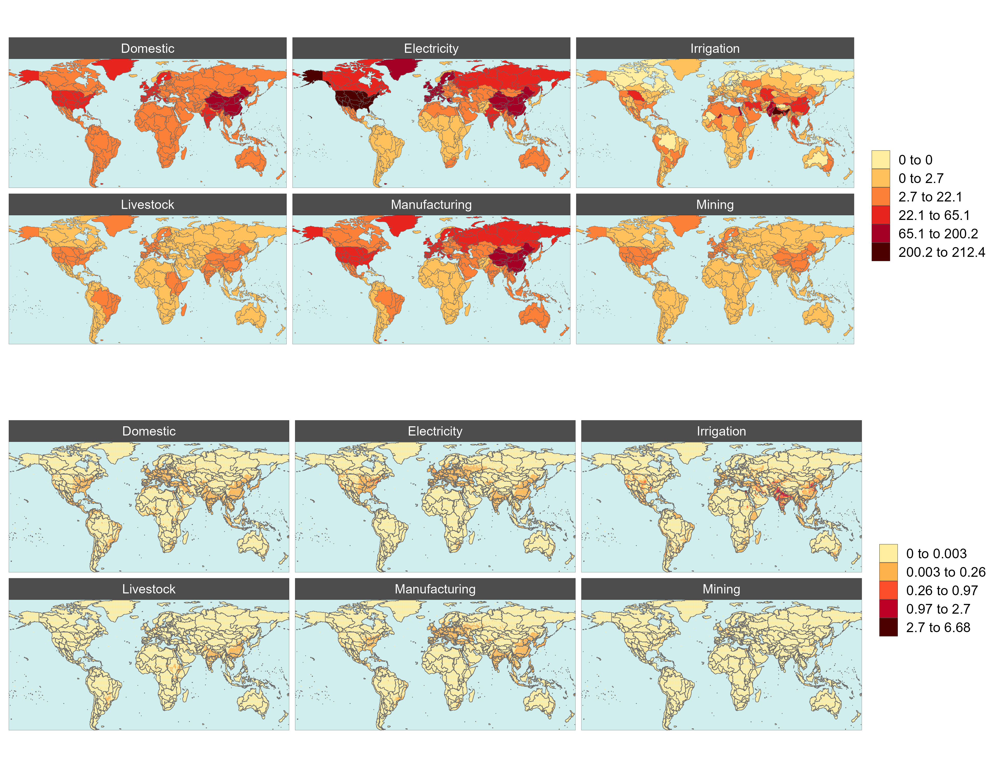
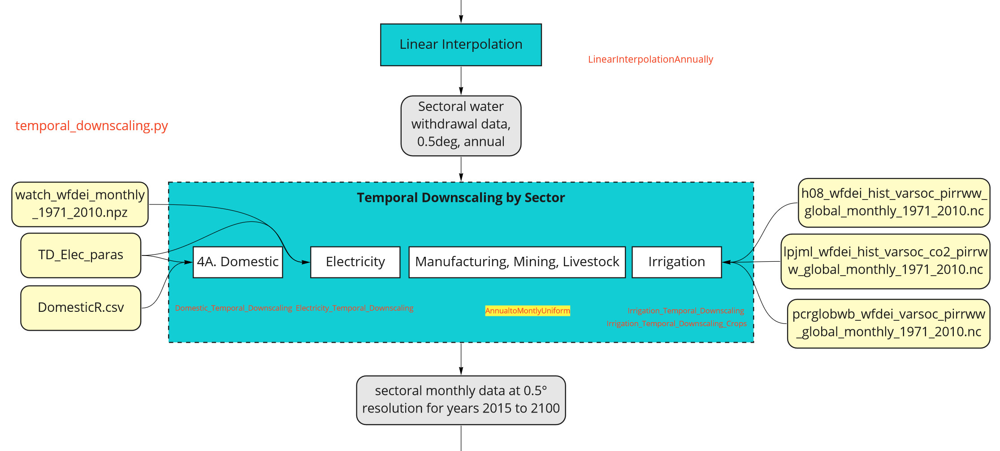
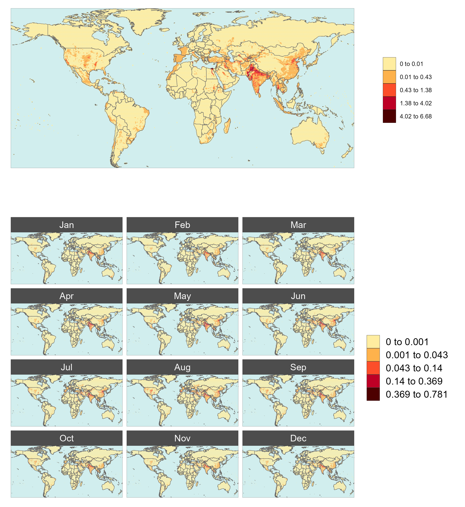
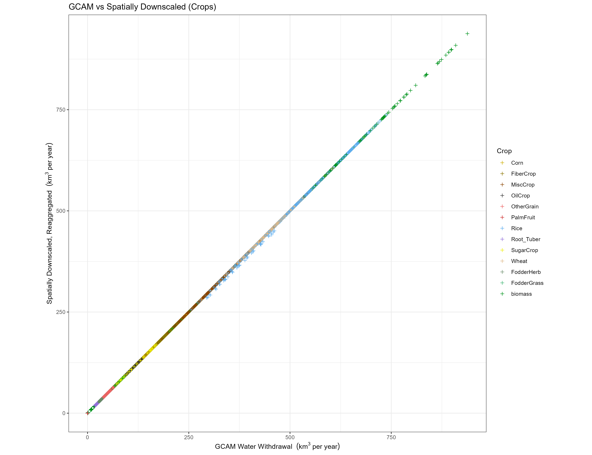

<!-------------------------->
<!-------------------------->
# Citation
<!-------------------------->
<!-------------------------->
<p align="center"> </p>

Khan, Z., Thompson, I., Vernon, C., 2022. A global gridded monthly water withdrawal dataset for multiple sectors from 2010 to 2100 at 0.5° resolution under a range of socioeconomic and climate scenarios. (In progress) Journal_TBD, DOI: XXXX

<!-------------------------->
<!-------------------------->
# Models Used
<!-------------------------->
<!-------------------------->
<p align="center"> </p>

```{r, results = 'show', eval=TRUE, echo=FALSE, warning=FALSE, error = FALSE, message = FALSE}
library(kableExtra)
data.frame(
    Model = c("Tethys"),
    Version = c("v1.3.0?"),
    Description = c("Spatiotemporal downscaling model for global water use"),
    Language = c("Python"),
    Link = c("https://jgcri.github.io/tethys/")
    ) %>% 
  kbl() %>%
  kable_styling(bootstrap_options = c("striped", "hover", "condensed", "responsive"))

```


<!-------------------------->
<!-------------------------->
# Data Inputs
<!-------------------------->
<!-------------------------->
<p align="center"> </p>

```{r, results = 'show', eval=TRUE, echo=FALSE, warning=FALSE, error = FALSE, message = FALSE}
library(kableExtra)
data.frame(
  Data = c("GCAM Outputs",
           "Demeter Outputs"),
  Source = c("GCAM runs",
             "Demeter runs"),
  `Used by` = c("Tethys",
                "Tethys"),
  Location = c("https://data.pnnl.gov/dataset/13224",
               "https://data.pnnl.gov/dataset/13192")
    ) %>% 
  kbl() %>%
  kable_styling(bootstrap_options = c("striped", "hover", "condensed", "responsive"))

```
<!-------------------------->
<!-------------------------->
# Data Outputs
<!-------------------------->
<!-------------------------->
<p align="center"> </p>

```{r, results = 'show', eval=TRUE, echo=FALSE, warning=FALSE, error = FALSE, message = FALSE}
library(kableExtra)
data.frame(
  Data = c("Tethys Outputs"),
  Source = c("Tethys runs"),
  `Used by` = c(""),
  Location = c("zenodo link")
    ) %>% 
  kbl() %>%
  kable_styling(bootstrap_options = c("striped", "hover", "condensed", "responsive"))

```

<!-------------------------->
<!-------------------------->
# Workflows
<!-------------------------->
<!-------------------------->
<p align="center"> </p>

```{r, echo=FALSE, out.width="40%", fig.align='center', fig.cap="Workflow Summary"}
knitr::include_graphics("vignetteFigs/workflow_summary.jpg")
```

# Workflow 1 - Scenarios
This dataset contains water withdrawal projections under a range of socioeconomic and climate scenarios. Combinations of five Shared Socioeconomic Pathways (SSPs 1-5) and four Representative Concentration Pathways (RCPs 2.6, 4.5, 6, and 8.5) are used. However, RCP 2.6 is not considered possible under SSP 3, and RCP 8.5 is only considered possible for SSP 5. This leaves 15 valid SSP-RCP combinations, shown in the diagram below.

```{r, echo=FALSE, out.width="100%", fig.align='center', fig.cap="Workflow 1"}

```

For each valid SSP-RCP combination, five General Circulation Models (GCMs). This gives a grand total of 75 SSP-RCP-GCM combinations, which are fed into the models.

# Workflow 2 - Model Runs
(Comment on GCAM, Xanthos, Demeter)
GCAM is run for each SSP-RCP-GCM combination. The GCAM outputs are at the resolution of 32 geopolitical regions, and 235 water basins, with 5-year timesteps. The sectoral water withdrawal outputs from GCAM are the primary inputs to Tethys, which will be downscaled to the target resolution. Crop outputs from GCAM are sent to Demeter for downscaling, to be used by Tethys for the irrigation sector.

```{r, echo=FALSE, out.width="100%", fig.align='center', fig.cap="Workflow 2"}

```

# Workflow 3 - Spatial Downscaling
Withdrawal data for each sector is downscaled spatially first, from 32 regions or 235 basins to 0.5 degree grids. Of the 259,200 possible grid cells at this resolution (360 x 720), only the 67,420 cells categorized as land are considered (since nobody is withdrawing water from the bottom of the ocean).

```{r, echo=FALSE, out.width="100%", fig.align='center', fig.cap="Workflow 3"}

```
```{r, echo=FALSE, out.width="100%", fig.align='center', fig.cap="Spatial Workflow"}

```

Different downscaling methods are used for different sectors. For spatial downscaling, the workflow is divided into three parts:

* A. Nonagricultural Sectors
* B. Livestock
* C. Irrigation

## Workflow 3A - Nonagricultural Sectors
For nonagricultural sectors (domestic, electricity, manufacturing, and mining), water withdrawal in each grid cell is assumed to be proportional to that cell’s population.
(equation, supporting files, function name)

## Workflow 3B - Livestock
Gridded global maps of livestock in six types (cattle, buffalo, sheep, goats, pigs and poultry) are used as a proxy to downscale livestock water withdrawal.

## Workflow 3C - Irrigation
Uses Demeter outputs.

# Workflow 4 - Temporal Downscaling
At this stage the data has been downscaled spatially to 0.5 degree grids, but is still in 5-year timesteps. First, linear interpolation is applied to produce annual data. Then, downscaling algorithms are applied to each sector to produce monthly data with seasonal variation.

```{r, echo=FALSE, out.width="100%", fig.align='center', fig.cap="Workflow 4"}

```

```{r, echo=FALSE, out.width="100%", fig.align='center', fig.cap="Temporal Workflow"}

```

```{r, echo=FALSE, out.width="100%", fig.align='center', fig.cap="Temporal Workflow"}

```

For temporal downscaling, the workflow is divided into four parts:

* A. Livestock, Manufacturing, and Mining
* B. Domestic
* C. Electricity Generation
* D. Irrigation

## Workflow 4A - Livestock, Manufacturing, and Mining
For livestock, manufacturing, and mining, a uniform distribution is applied. The withdrawal for the year is divided between months according to the number of days.

## Workflow 4B - Domestic
Temporally downscaling domestic withdrawal is based on monthly average temperatures, and the relative withdrawals between warmest and coolest months.

## Workflow 4C - Electricity Generation
Assume water use is proportional to electricity generated. Formula based on HDD, CDD.

## Workflow 4D - Irrigation
Monthly weighted irrigation profiles based on region and crop type.

# Workflow 5 - Results
The below summary figures provide a qualitative overview of the data at a glance.

## Annual
```{r, echo=FALSE, out.width="100%", fig.align='center', fig.cap="Total Annual Water Withdrawal by SSP-RCP-GCM"}
knitr::include_graphics("vignetteFigs/figure1.png")
```
```{r, echo=FALSE, out.width="100%", fig.align='center', fig.cap="Global Annual Water Withdrawal by SSP-RCP-GCM and Sector"}
knitr::include_graphics("vignetteFigs/figure2.png")
```
```{r, echo=FALSE, out.width="100%", fig.align='center', fig.cap="Global Annual Water Withdrawal by SSP-RCP-GCM and Crop"}
knitr::include_graphics("vignetteFigs/figure6.png")
```

<!-- # ```{r, echo=FALSE, out.width="100%", fig.align='center', fig.cap="Global Annual Water Withdrawal by SSP-RCP-Sector, GCM: gfdl"} -->
<!-- # knitr::include_graphics("vignetteFigs/figure3a.png") -->
<!-- # ``` -->
<!-- # ```{r, echo=FALSE, out.width="100%", fig.align='center', fig.cap="TGlobal Annual Water Withdrawal by SSP-RCP-Sector, GCM: hadgem"} -->
<!-- # knitr::include_graphics("vignetteFigs/figure3b.png") -->
<!-- # ``` -->
<!-- # ```{r, echo=FALSE, out.width="100%", fig.align='center', fig.cap="Global Annual Water Withdrawal by SSP-RCP-Sector, GCM: ipsl"} -->
<!-- # knitr::include_graphics("vignetteFigs/figure3c.png") -->
<!-- # ``` -->
<!-- # ```{r, echo=FALSE, out.width="100%", fig.align='center', fig.cap="Global Annual Water Withdrawal by SSP-RCP-Sector, GCM: miroc"} -->
<!-- # knitr::include_graphics("vignetteFigs/figure3d.png") -->
<!-- # ``` -->
<!-- # ```{r, echo=FALSE, out.width="100%", fig.align='center', fig.cap="Global Annual Water Withdrawal by SSP-RCP-Sector, GCM: noresm"} -->
<!-- # knitr::include_graphics("vignetteFigs/figure3e.png") -->
<!-- #``` -->

## Monthly
```{r, echo=FALSE, out.width="100%", fig.align='center', fig.cap="Monthly Example"}
knitr::include_graphics("vignetteFigs/figure4a.png")
```
```{r, echo=FALSE, out.width="100%", fig.align='center', fig.cap="Without Irrigation"}
knitr::include_graphics("vignetteFigs/figure4b.png")
```
```{r, echo=FALSE, out.width="100%", fig.align='center', fig.cap="Selected Crops"}
knitr::include_graphics("vignetteFigs/figure5.png")
```

# Validation
In order for the downscaling to be considered valid, it must preserve the total amount of water withdrawn within each sector, for each subregion and year. Of course, some small differences are inevitable due to the nature of floating point calculations, but the outputs should be consistent with the inputs.

It should be noted that being consistent with the inputs is merely a necessary condition, and does not in and of itself mean that the outputs will match observed values. This discussion is outside the scope of this paper. For comments justification on the downscaling algorithms and assumptions made, refer to the references.

## Spatial
```{r, echo=FALSE, out.width="100%", fig.align='center', fig.cap="GCAM inputs vs grids Reaggregated"}
knitr::include_graphics("vignetteFigs/validation1.png")
```
```{r, echo=FALSE, out.width="100%", fig.align='center', fig.cap="GCAM inputs vs grids Reaggregated"}

```

## Temporal
```{r, echo=FALSE, out.width="100%", fig.align='center', fig.cap="Annual vs Reaggregated Monthly"}

```
```{r, echo=FALSE, out.width="100%", fig.align='center', fig.cap="Annual vs Reaggregated Monthly"}
knitr::include_graphics("vignetteFigs/validation4.png")
```

# Regional Spotlights
We have selected the following regions from literature to explore in more detail, as a way of showing the full resolution of this data set and the kinds of analyses it allows for.

## Indus
Placeholder Text

Make the text longer so I can see how

The webpage looks

at the bottom

more

## Nile
Placeholder Text

## Colorado
Placeholder Text


