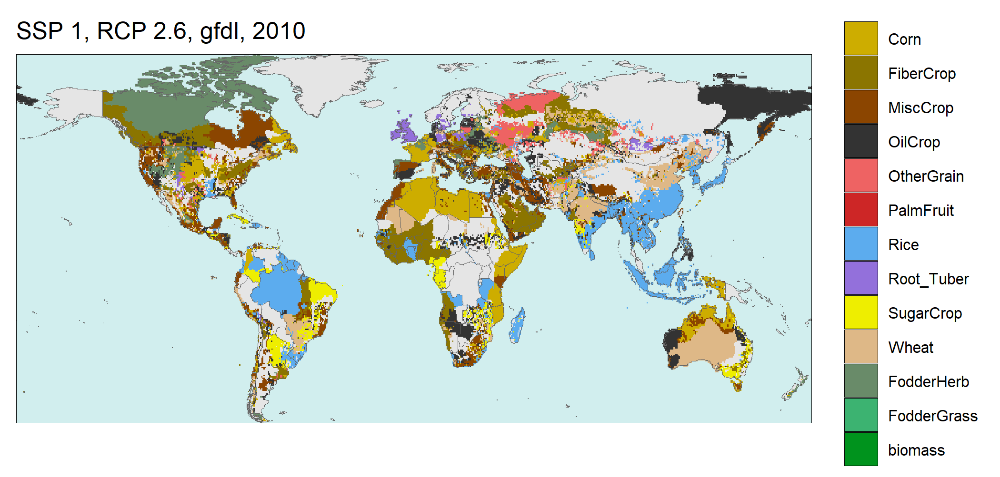

<div class="header_logo">

</div>

<br>
<br>

<!-------------------------->
<!-------------------------->
### **A global gridded monthly water withdrawal dataset for multiple sectors from 2015 to 2100 at 0.5° resolution under a range of socioeconomic and climate scenarios**
<!-------------------------->
<!-------------------------->
<p align="center"> </p>

Future sectoral-specific water withdrawals at a temporal resolution capable of representing patterns in seasonality and a commonly used spatial resolution are an important factor to consider for energy, water, land and environmental research.  Projected water withdrawals that are harmonized with assumptions for alternate futures that capture socioeconomic and climatic variation are critical for many modeling studies on future global and regional dynamics. Here we generate a novel global gridded water withdrawals dataset by coupling Global Change Analysis Model (GCAM) with a land use spatial downscaling model (Demeter), a global hydrologic framework (Xanthos) and a water withdrawal downscaling model (Tethys) for the five Shared Socioeconomic Pathways (SSPs) and four Representative Concentration Pathways (RCPs) scenarios. The dataset provides sectoral monthly data at 0.5° resolution for years 2015 to 2100. The presented dataset will be useful for both global and regional analysis looking at the impacts of socioeconomic, climate and technological futures as well as in characterizing the uncertainties associated with these impacts.

<p align="center"> </p>

<a href = "metarepo.html">
```{r, echo=FALSE, out.width="60%", fig.align = 'center'}

```
</a>
