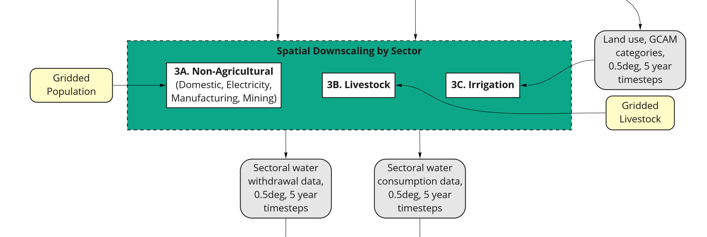
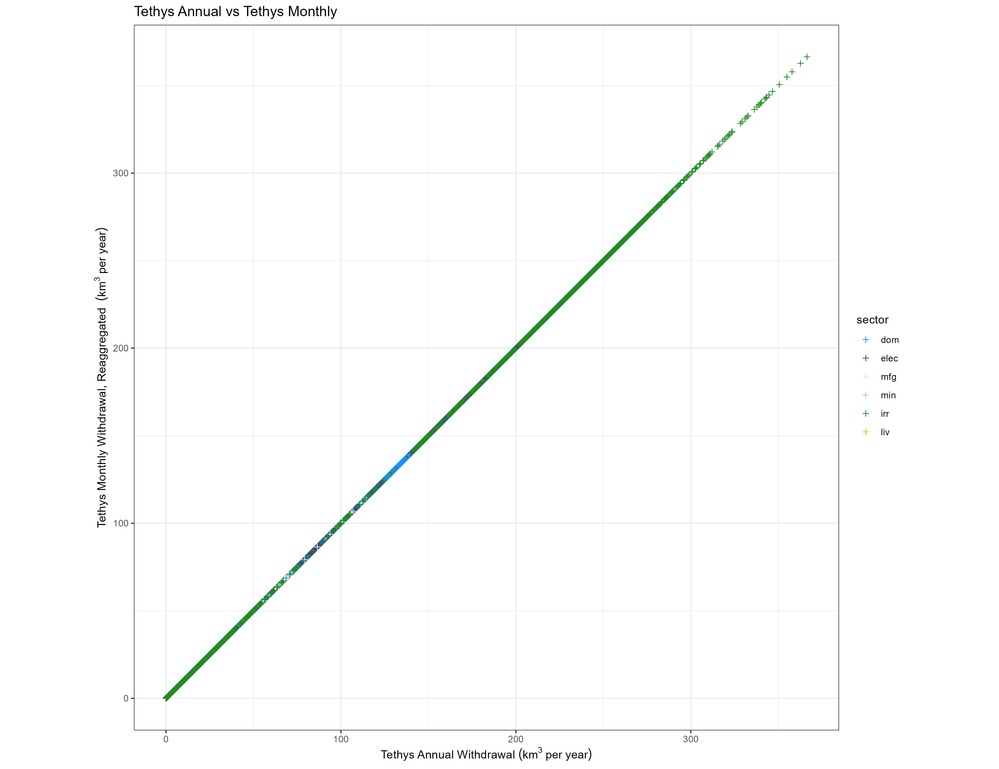

<!-- Allow href to tabsets --> 
```{js, echo=FALSE}
function goToTab() {
  var hash = String(window.location.href.match("#.*$"));
  var target = document.querySelector("a[role = 'tab'][href='" + hash + "']");
  if (target !== null) {
    var greatGrandParent = target.parentElement.parentElement.parentElement;
    if (greatGrandParent.getAttribute("role") == "tabpanel") {
      document.querySelector("a[role = 'tab'][href='#" + greatGrandParent.getAttribute("id") + "']").click();
    }
    target.click();
    target.scrollIntoView();
  }
}

window.onload = function() {
  setTimeout(goToTab, 1000);
}

window.onhashchange = goToTab;
```

```{r setup, echo=FALSE}
sector_names = c("total"       = "Total",
                 "dom"         = "Domestic",
                 "elec"        = "Electricity",
                 "mfg"         = "Manufacturing",
                 "min"         = "Mining",
                 "liv"         = "Livestock",
                 "irr"         = "Irrigation",
                 "Corn"        = "Corn",
                 "FiberCrop"   = "Fiber Crop",
                 "MiscCrop"    = "Misc Crop",
                 "OilCrop"     = "Oil Crop",
                 "OtherGrain"  = "Other Grain",
                 "PalmFruit"   = "Palm Fruit",
                 "Rice"        = "Rice",
                 "Root_Tuber"  = "Root Tuber",
                 "SugarCrop"   = "Sugar Crop",
                 "Wheat"       = "Wheat",
                 "FodderHerb"  = "Fodder Herb",
                 "FodderGrass" = "Fodder Grass",
                 "biomass"     = "Biomass")

scenario_names = c("ssp1_rcp26_gfdl"   = "SSP 1, RCP 2.6, gfdl",
                   "ssp2_rcp45_hadgem" = "SSP 2, RCP 4.5, hadgem",
                   "ssp3_rcp60_ipsl"   = "SSP 3, RCP 6.0, ipsl",
                   "ssp4_rcp45_miroc"  = "SSP 4, RCP 4.5, miroc",
                   "ssp5_rcp85_noresm" = "SSP 5, RCP 8.5, noresm")
```

<div class="header_logo">


</div>

<!-------------------------->
<!-------------------------->
# Citation
<!-------------------------->
<!-------------------------->
<p align="center"> </p>

Khan, Z., Thompson, I., Vernon, C., Graham, N., Wild, T.B., Chen, M., 2022. A global gridded monthly water withdrawal dataset for multiple sectors from 2010 to 2100 at 0.5° resolution under a range of socioeconomic and climate scenarios. (In progress) Journal_TBD, DOI: XXXX

<br>

<!-------------------------->
<!-------------------------->
# Models Used
<!-------------------------->
<!-------------------------->
<p align="center"> </p>

```{r, results = 'show', eval=TRUE, echo=FALSE, warning=FALSE, error = FALSE, message = FALSE}
library(kableExtra)
data.frame(
    Model = c("Tethys"),
    Version = c("v1.3.1"),
    Description = c("Spatiotemporal downscaling model for global water use"),
    Language = c("Python"),
    DOI = c("https://doi.org/10.5281/zenodo.6399488")
    ) %>% 
  kbl() %>%
  kable_styling(bootstrap_options = c("striped", "hover", "condensed", "responsive"))
```

<br>

<!-------------------------->
<!-------------------------->
# Data Inputs
<!-------------------------->
<!-------------------------->
<p align="center"> </p>

```{r, results = 'show', eval=TRUE, echo=FALSE, warning=FALSE, error = FALSE, message = FALSE}
library(kableExtra)
data.frame(
  Data = c("GCAM Outputs",
           "Demeter Outputs"),
  Version = c("v4.3.chen http://doi.org/10.5281/zenodo.3713432",
              "v1.chen http://doi.org/10.5281/zenodo.3713378"),
  Location = c("https://data.pnnl.gov/dataset/13224",
               "https://data.pnnl.gov/dataset/13192")
    ) %>% 
  kbl() %>%
  kable_styling(bootstrap_options = c("striped", "hover", "condensed", "responsive"))
```

<br>

<!-------------------------->
<!-------------------------->
# Data Outputs
<!-------------------------->
<!-------------------------->
<p align="center"> </p>

```{r, results = 'show', eval=TRUE, echo=FALSE, warning=FALSE, error = FALSE, message = FALSE}
library(kableExtra)
data.frame(
  Dataset = c("Tethys Outputs"),
  Version = c("v1.3.0"),
  Location = c("https://doi.org/10.7910/DVN/VIQEAB")
    ) %>% 
  kbl() %>%
  kable_styling(bootstrap_options = c("striped", "hover", "condensed", "responsive"))
```

<br>

<!-------------------------->
<!-------------------------->
# Workflow Overview
<!-------------------------->
<!-------------------------->
<p align="center"> </p>

```{r, echo=FALSE, out.width="40%", fig.align='center', fig.cap="Workflow Summary"}

```

<br>

<!-------------------------->
<!-------------------------->
# Workflow 1 - Scenarios
<!-------------------------->
<!-------------------------->
<p align="center"> </p>

This data set contains water withdrawal projections under a range of socioeconomic and climate scenarios. Combinations of five Shared Socioeconomic Pathways (SSPs 1-5) and four Representative Concentration Pathways (RCPs 2.6, 4.5, 6, and 8.5) are used. However, RCP 2.6 is not considered possible for SSP 3, and RCP 8.5 is only considered possible for SSP 5. This leaves 15 valid SSP-RCP combinations, shown in the diagram below.

```{r, echo=FALSE, out.width="100%", fig.align='center', fig.cap="Workflow 1"}
knitr::include_graphics("images/workflow1.jpg")
```

For each valid SSP-RCP combination, five General Circulation Models (GCMs) are used. This gives a grand total of 75 SSP-RCP-GCM combinations, which are fed into GCAM.

<br>

<!-------------------------->
<!-------------------------->
# Workflow 2 - Model Runs
<!-------------------------->
<!-------------------------->
<p align="center"> </p>

GCAM is run for each SSP-RCP-GCM combination. The GCAM outputs are at the resolution of 32 geopolitical regions, and 235 water basins, with 5-year timesteps. The sectoral water withdrawal outputs from GCAM are the primary inputs to Tethys, which will be downscaled to the target resolution. Crop outputs from GCAM are sent to Demeter for downscaling, to be used by Tethys for the irrigation sector.

```{r, echo=FALSE, out.width="100%", fig.align='center', fig.cap="Workflow 2"}
knitr::include_graphics("images/workflow2.jpg")
```

<br>

<!-------------------------->
<!-------------------------->
# Workflow 3 - Spatial Downscaling
<!-------------------------->
<!-------------------------->
<p align="center"> </p>

```{r, echo=FALSE, out.width="75%", fig.align='center', fig.cap="Spatial Workflow"}
knitr::include_graphics("images/spatialworkflow.png")
```

Water withdrawals and consumption data for each sector are downscaled spatially first, from GCAM's 32 regions (or in the case of irrigation, 434 region-basin intersections) to a 0.5 degree gridded format. Of the 259,200 possible grid cells at this resolution (360 x 720), only the 67,420 cells categorized as land are considered.
Different sectors use different algorithms to allocate a region's water withdrawals and consumption among its constituent grid cells, but in principle they are very similar: use gridded values of some proxy quantity to approximate the spatial distribution (i.e., divide each cell's value by the total of all cells belonging to that region), then apply that distribution to GCAM's value. These algorithms were derived from research by Edmonds and Reilly, 1985.

For spatial downscaling, the workflow is divided into three parts:

* A. Nonagricultural Sectors
* B. Livestock
* C. Irrigation

These are explained in detail in their respective subsections. Keep in mind that downscaling occurs not just for all regions in a single slice of time, but for every 5 years from 2010 to 2100, across 75 alternative futures (SSP-RCP-GCM combinations).

```{r, echo=FALSE, out.width="100%", fig.align='center', fig.cap="Workflow 3"}

```

<br>

<!-------------------------->
## Workflow 3A - Nonagricultural Sectors
<!-------------------------->

For nonagricultural sectors (domestic, electricity, manufacturing, and mining), water withdrawals and consumption in each grid cell are assumed to be proportional to that cell’s population. The population data set used for this paper is from Gridded Population of the World (CIESIN, 2016). Tethys uses the nearest available year, which for this paper was 2010 in 2010, and 2015 in all other years.
Each region's population is determined by taking the sum of population over all cells belonging to that region. For each of these sectors, Tethys calculates the withdrawal for a given cell by

$$\text{withdrawal}_\text{cell} = \text{withdrawal}_\text{region} \times \frac{\text{population}_\text{cell}}{\text{population}_\text{region}}.$$
An analogous formula is used for consumption:
$$\text{consumption}_\text{cell} = \text{consumption}_\text{region} \times \frac{\text{population}_\text{cell}}{\text{population}_\text{region}}.$$
```{r, results = 'show', eval=TRUE, echo=FALSE, warning=FALSE, error = FALSE, message = FALSE}
library(kableExtra)
data.frame(
  Name = c("Gridded Population of the World, Version 4"),
  File = c("GPW_population.csv"),
  Reference = c("CIESIN, 2016"),
  Source = c("http://dx.doi.org/10.7927/H4X63JVC")
    ) %>% 
  kbl() %>%
  kable_styling(bootstrap_options = c("striped", "hover", "condensed", "responsive"))
```

<br>

<!-------------------------->
## Workflow 3B - Livestock
<!-------------------------->

Gridded global maps (Wint and Robinson, 2007) for six types of livestock (cattle, buffalo, sheep, goats, pigs, and poultry) are used as a proxy to downscale livestock water withdrawal and consumption. GCAM outputs are organized into five types (beef, dairy, pork, poultry, and "sheepgoat"), so these are first reorganized to match the six maps using ratios for each region, estimated from FAO gridded livestock of the world. These are stored in the files bfracFAO2005.csv ("buffalo fraction") and gfracFAO2005.csv ("goat fraction"). The following formulas are used for each region:

$$\begin{align}
\text{buffalo} &= (\text{beef} + \text{dairy}) \times \text{bfrac}\\
\text{cattle} &= (\text{beef} + \text{dairy}) \times (1-\text{bfrac})\\
\text{goat} &= \text{sheepgoat} \times \text{gfrac}\\
\text{sheep} &= \text{sheepgoat} \times (1-\text{gfrac})
\end{align}$$

No adjustment is required for pork (pigs) or poultry. After this, downscaling for each livestock type is very similar to downscaling the nonagricultural sectors, except the respective livestock population (heads) is used as the proxy instead of human population.

$$\text{withdrawal}_\text{animal, cell} = \text{withdrawal}_\text{animal, region} \times \frac{\text{heads}_\text{animal, cell}}{\text{heads}_\text{animal, region}}.$$

The results for each of the six types are then added together to get the total livestock withdrawal for each cell:

$$\begin{align}
\text{withdrawal}_\text{livestock, cell} =
&\phantom{{}+{}}\text{withdrawal}_\text{cattle, cell}\\
&+ \text{withdrawal}_\text{buffalo, cell}\\
&+ \text{withdrawal}_\text{sheep, cell}\\
&+ \text{withdrawal}_\text{goat, cell}\\
&+ \text{withdrawal}_\text{pig, cell}\\
&+ \text{withdrawal}_\text{poultry, cell}
\end{align}$$

Again, analogous formulas follow for consumption.

```{r, results = 'show', eval=TRUE, echo=FALSE, warning=FALSE, error = FALSE, message = FALSE}
library(kableExtra)
data.frame(
  Name = c("Gridded Livestock of the World",
           "Buffalo Fraction",
           "Goat Fraction"),
  File = c("livestock_<animal>.csv",
           "bfracFAO2005.csv",
           "gfracFAO2005.csv"),
  Reference = c("Wint and Robinson, 2007",
                '"estimated from FAO gridded livestock of the world"',
                '"estimated from FAO gridded livestock of the world"'),
  Source = c("http://www.fao.org/docrep/010/a1259e/a1259e00.htm",
             "",
             "")
    ) %>% 
  kbl() %>%
  kable_styling(bootstrap_options = c("striped", "hover", "condensed", "responsive"))
```

<br>

<!-------------------------->
## Workflow 3C - Irrigation
<!-------------------------->

GCAM irrigation withdrawal and consumption outputs are organized by 13 crop types: Biomass, Corn, Fiber Crop, Misc Crop, Oil Crop, Other Grain, Palm Fruit, Rice, Root Tuber, Sugar Crop, Wheat, Fodder Herb, and Fodder Grass. Demeter provides a spatial landcover breakdown by all crop types except biomass, which is downscaled uniformly within a region-basin intersection (with respect to land area).

$$\text{withdrawal}_\text{biomass, cell} = \text{withdrawal}_\text{biomass, region} \times \frac{\text{area}_\text{cell}}{\text{area}_\text{region}},$$

When possible, the other 12 crops are downscaled in proportion to the crop land area maps from Demeter, which have been reaggregated to the target resolution of 0.5 degrees. There are certain exceptions. If the GCAM withdrawal or consumption value for a crop in some region-basin is nonzero, but Demeter does not show any cells with that crop type in that region-basin, it will be downscaled uniformly, the same as biomass.

Additionally, it is possible for GCAM and Demeter have different total crop irrigation areas for a region basin intersection, so applying the raw Demeter ratios to irrigation withdrawals or consumption (which are directly related to irrigation areas) could result in cell withdrawal values that imply larger irrigation area than total cell area. In order to avoid this nonphysical situation, excess irrigation area in cells that are above capacity is assigned evenly among irrigated cells with capacity remaining if there are any, otherwise it is assigned evenly among the remaining cells in the region-basin. Should there still be excess after those cells have been filled, it would be dropped.

Using these adjusted irrigation area values for each crop, cell withdrawal values are given by

$$\text{withdrawal}_\text{crop, cell} = \text{withdrawal}_\text{crop, region} \times \frac{\text{area}_\text{crop, cell}}{\text{area}_\text{crop, region}},$$

and the analogous formula is used for consumption. The total irrigation sector value for a cell is the sum of that cell's values for all 13 crops.

Note that 6 of the 434 region-basin intersections are so small that they are not represented in the 0.5 degree mapping, causing any of their irrigation withdrawals or consumption to be dropped, though these values are correspondingly small.


<br>

<!-------------------------->
<!-------------------------->
# Workflow 4 - Temporal Downscaling
<!-------------------------->
<!-------------------------->
<p align="center"> </p>

At this stage GCAM values have been downscaled spatially to 0.5 degree grids, but are still in 5 year timesteps. First, linear interpolation is applied to produce annual data. Then, downscaling algorithms are applied to each sector to produce monthly data with seasonal variation.

For spatial downscaling, the workflow is divided into four parts:

* A. Livestock, Manufacturing, and Mining
* B. Domestic
* C. Electricity Generation
* D. Irrigation

```{r, echo=FALSE, out.width="100%", fig.align='center', fig.cap="Workflow 4"}
knitr::include_graphics("images/workflow4.jpg")
```

```{r, echo=FALSE, out.width="100%", fig.align='center', fig.cap="Temporal Workflow"}
knitr::include_graphics("images/temporalworkflow.png")
```


<!-------------------------->
## Workflow 4a - Domestic
<!-------------------------->

Temporally downscaling domestic withdrawal uses a formula from Wada et al., 2011 (http://dx.doi.org/10.1029/2010WR009792), with data from Huang et al. 2017 (https://doi.org/10.5194/hess-2017-551). Withdrawals for each month of a year for some cell are given by the formula

$$\text{withdrawal}_\text{month} = \frac{\text{withdrawal}_\text{year}}{12} \times \left(\frac{\text{temperature}_\text{month} - \text{temperature}_\text{mean}}{\text{temperature}_\text{max} - \text{temperature}_\text{min}}R + 1\right).$$

Here $\text{temperature}_\text{month}$ is the average temperature that month, $\text{temperature}_\text{mean}$, $\text{temperature}_\text{max}$, and $\text{temperature}_\text{min}$ are the mean, maximum, and minimum among monthly average temperatures for that year. $R$ is a parameter representing the relative difference of water withdrawals between the warmest and coolest months of the year. Note that the monthly values given by this formula add back up to the total for the year (at least conceptually, since floating point arithmetic doesn't work out perfectly).

```{r, results = 'show', eval=TRUE, echo=FALSE, warning=FALSE, error = FALSE, message = FALSE}
library(kableExtra)
data.frame(
  Name = c("Domestic R",
           "WFDEI"),
  File = c("DomesticR.csv",
           "watch_wfdei_monthly_1971_2010.npz"),
  Reference = c("Huang et al., 2017",
                "Weedon et al., 2014"),
  Source = c("https://doi.org/10.5194/hess-2017-551",
             "https://doi.org/10.1002/2014WR015638")
    ) %>% 
  kbl() %>%
  kable_styling(bootstrap_options = c("striped", "hover", "condensed", "responsive"))
```

<br>

<!-------------------------->
## Workflow 4B - Electricity Generation
<!-------------------------->

Water withdrawal and consumption for electricity generation each month are assumed to be proportional to the amount of electricity generated, using the formula developed in Voisin et al., 2013 (https://doi.org/10.5194/hess-17-4555-2013).

$$\text{withdrawal}_\text{month} = \text{withdrawal}_\text{year} \times \left[p_\text{b}\times\left(p_\text{h}\frac{\text{HDD}_\text{month}}{\text{HDD}_\text{year}} + p_\text{c}\frac{\text{CDD}_\text{month}}{\text{CDD}_\text{year}}+p_\text{u}\frac{1}{12}\right) + p_\text{it}\frac{1}{12}\right].$$

Here $p_\text{b}$ and $p_\text{it}$ are the proportions of electricity used for buildings and industry/transportation respectively, with $p_\text{b} + p_\text{it} = 1$. The electricity use for industry and transportation is assumed to be uniform throughout the year, while building electricity is further broken down by heating ($p_\text{h}$), cooling ($p_\text{c}$), and other ($p_\text{u}$), with $p_\text{h} + p_\text{c} + p_\text{u} = 1$.

Heating degree days (HDD) and cooling degree days (CDD) are indicators for the amount of electricity used to heat and cool buildings, and are calculated from mean daily outdoor air temperature. HDD for a month is the sum of $(18-\text{temperature}_\text{day})$ across all days where temperature is less than 18 degrees Celsius. CDD is the sum of $(\text{temperature}_\text{day} - 18)$ across all days where temperature is greater than 18. Annual HDD and CDD are the sum of their respective monthly values.

Tethys uses HDD, CDD, and $p$ values for each cell from the nearest available year in the input files listed at the end of this subsection, which is 2010 for this data set.

The formula is modified for cells with low annual HDD or CDD as described in Huang et al., 2017, since these may not have heating or cooling services despite nonzero values of $p_\text{h}$ or $p_\text{c}$. When $\text{HDD}_\text{year} < 650$, The HDD term is removed and $p_\text{h}$ is reallocated to the cooling proportion, giving

$$\text{withdrawal}_\text{month} = \text{withdrawal}_\text{year} \times \left[p_\text{b}\times\left((p_\text{h} + p_\text{c})\frac{\text{CDD}_\text{month}}{\text{CDD}_\text{year}}+p_\text{u}\frac{1}{12}\right) + p_\text{it}\frac{1}{12}\right].$$

Likewise, when $\text{CDD}_\text{year} < 450$, the formula becomes

$$\text{withdrawal}_\text{month} = \text{withdrawal}_\text{year} \times \left[p_\text{b}\times\left((p_\text{h} + p_\text{c})\frac{\text{HDD}_\text{month}}{\text{HDD}_\text{year}}+p_\text{u}\frac{1}{12}\right) + p_\text{it}\frac{1}{12}\right].$$

When annual HDD and CDD are both below their respective thresholds, all sources of monthly variation vanish and the formula reduces to

$$\text{withdrawal}_\text{month} = \frac{\text{withdrawal}_\text{year}}{12}.$$

Analogous formulas follow for consumption.

```{r, results = 'show', eval=TRUE, echo=FALSE, warning=FALSE, error = FALSE, message = FALSE}
library(kableExtra)
data.frame(
  Name = c("Building Proportion",
           "Industry/Technology Proportion",
           "Heating Proportion",
           "Cooling Proportion",
           "Other Proportion",
           "WFDEI"),
  File = c("ElecBuilding_1971_2010.csv",
           "ElecIndustry_1971_2010.csv",
           "ElecBuildingHeat_1971_2010.csv",
           "ElecBuildingCool_1971_2010.csv",
           "ElecBuildingOthers_1971_2010.csv",
           "watch_wfdei_monthly_1971_2010.npz"),
  Reference = c("IEA historical data, Huang et al., 2017",
                "IEA historical data, Huang et al., 2017",
                "IEA historical data, Huang et al., 2017",
                "IEA historical data, Huang et al., 2017",
                "IEA historical data, Huang et al., 2017",
                "Weedon et al., 2014"),
  Source = c("https://doi.org/10.5194/hess-2017-551",
             "https://doi.org/10.5194/hess-2017-551",
             "https://doi.org/10.5194/hess-2017-551",
             "https://doi.org/10.5194/hess-2017-551",
             "https://doi.org/10.5194/hess-2017-551",
             "https://doi.org/10.1002/2014WR015638")
    ) %>% 
  kbl() %>%
  kable_styling(bootstrap_options = c("striped", "hover", "condensed", "responsive"))
```

<br>

<!-------------------------->
## Workflow 4C - Livestock, Manufacturing, and Mining
<!-------------------------->

For livestock, manufacturing, and mining, a uniform distribution is applied. The withdrawal or consumption for the year is divided between months according to the number of days.

$$\text{withdrawal}_\text{month} = \text{withdrawal}_\text{year} \times \frac{\text{days}_\text{month}}{\text{days}_\text{year}}.$$
$$\text{consumption}_\text{month} = \text{consumption}_\text{year} \times \frac{\text{days}_\text{month}}{\text{days}_\text{year}}.$$

<br>

<!-------------------------->
## Workflow 4D - Irrigation
<!-------------------------->

Temporal downscaling for irrigation water withdrawal and consumption is based on weighted irrigation profiles for each of the 235 basins. Monthly irrigation withdrawal values from the PCR-GLOBWB global hydrological model are averaged across the years 1971-2010, then aggregated to the basin scale. The monthly irrigation withdrawal percentages for a basin are applied to all crops in each of its cells:

$$\text{withdrawal}_\text{month} = \text{withdrawal}_\text{year} \times \text{percent}_\text{basin, month}.$$

In the event that the model has no monthly data for a basin with nonzero irrigation, the profile of the nearest available basin is used.

```{r, results = 'show', eval=TRUE, echo=FALSE, warning=FALSE, error = FALSE, message = FALSE}
library(kableExtra)
data.frame(
  Name = c("PCR‐GLOBWB",
           "Basin Distances"),
  File = c("pcrglobwb_wfdei_varsoc_pirrww_global_monthly_1971_2010.nc",
           "dist.csv"),

  Reference = c("Van Beek et al., 2011; Wada et al., 2011",
                ""),
  Source = c("original data files were obtained from ISI‐MIP (Warszawski et al., 2014), then processed into gridded monthly percentage values",
             "calculated from basin locations")
    ) %>% 
  kbl() %>%
  kable_styling(bootstrap_options = c("striped", "hover", "condensed", "responsive"))
```

<br>

<!-------------------------->
<!-------------------------->
# Workflow 5 - Results 
<!-------------------------->
<!-------------------------->
<p align="center"> </p>

<!-------------------------->
## Annual {.tabset}
<!-------------------------->

### Total {.tabset .tabset-pills}           
#### Withdrawal
```{r, echo=FALSE, out.width="100%", fig.align='center', fig.cap="Total Annual Water Withdrawal by SSP-RCP-GCM"}
knitr::include_graphics("images/figure1.png")
```
#### Consumption
```{r, echo=FALSE, out.width="100%", fig.align='center', fig.cap="Total Annual Water Consumption by SSP-RCP-GCM"}

```

### By Sector {.tabset .tabset-pills}

#### Withdrawal
```{r, echo=FALSE, out.width="100%", fig.align='center', fig.cap="Global Annual Water Withdrawal by SSP-RCP-GCM and Sector"}
knitr::include_graphics("images/figure2.png")
```
#### Consumption
```{r, echo=FALSE, out.width="100%", fig.align='center', fig.cap="Global Annual Water Consumption by SSP-RCP-GCM and Sector"}

```

### Crops {.tabset .tabset-pills}

#### Withdrawal
```{r, echo=FALSE, out.width="100%", fig.align='center', fig.cap="Global Annual Water Withdrawal by SSP-RCP-GCM and Crop"}
knitr::include_graphics("images/figure6.png")
```

#### Consumption
```{r, echo=FALSE, out.width="100%", fig.align='center', fig.cap="Global Annual Water Consumption by SSP-RCP-GCM and Crop"}

```

### GCMs {.tabset .tabset-pills}

#### GFDL
```{r, echo=FALSE, out.width="100%", fig.align='center', fig.cap="Global Annual Water Withdrawal by SSP-RCP-Sector, GCM: gfdl"}
knitr::include_graphics("images/figure3a.png")
```

#### HADGEM
```{r, echo=FALSE, out.width="100%", fig.align='center', fig.cap="TGlobal Annual Water Withdrawal by SSP-RCP-Sector, GCM: hadgem"}
knitr::include_graphics("images/figure3b.png")
```

#### IPSL
```{r, echo=FALSE, out.width="100%", fig.align='center', fig.cap="Global Annual Water Withdrawal by SSP-RCP-Sector, GCM: ipsl"}
knitr::include_graphics("images/figure3c.png")
```

#### MIROC
```{r, echo=FALSE, out.width="100%", fig.align='center', fig.cap="Global Annual Water Withdrawal by SSP-RCP-Sector, GCM: miroc"}
knitr::include_graphics("images/figure3d.png")
```

#### NORESM
```{r, echo=FALSE, out.width="100%", fig.align='center', fig.cap="Global Annual Water Withdrawal by SSP-RCP-Sector, GCM: noresm"}
knitr::include_graphics("images/figure3e.png")
```

<!-------------------------->
## Monthly {.tabset}
<!-------------------------->

### All Sectors
```{r, echo=FALSE, out.width="100%", fig.align='center', fig.cap="Monthly Example"}
knitr::include_graphics("images/figure4a.png")
```

### No Irrigation
```{r, echo=FALSE, out.width="100%", fig.align='center', fig.cap="Without Irrigation"}
knitr::include_graphics("images/figure4b.png")
```

### Crops
```{r, echo=FALSE, out.width="100%", fig.align='center', fig.cap="Without Irrigation"}
knitr::include_graphics("images/figure5.png")
```

<!-- <!--------------------------> -->
<!-- ## Maps {.tabset} -->
<!-- <!--------------------------> -->
<!-- ```{r, echo=FALSE, out.width="100%", fig.align='center'} -->
<!-- knitr::include_graphics("images/facetmapannual.png") -->
<!-- ``` -->
<!-- ```{r, echo=FALSE, out.width="100%", fig.align='center'} -->
<!-- knitr::include_graphics("images/facetmapmonthly.png") -->
<!-- ``` -->

<br>

<!-------------------------->
<!-------------------------->
# Validation
<!-------------------------->
<!-------------------------->
<p align="center"> </p>

It is important to confirm that the water withdrawal and consumption totals are preserved at all stages of the downscaling process. Floating point calculations lead to some loss of precision, but the downscaling algorithms themselves should not meaningfully change the totals.

While this is a necessary check, it does not necessarily say anything about the "correctness" of our downscaled results. Validation for the downscaling algorithms used by Tethys can be found in their respective sources. Additionally, we compare the spatial and temporal distributions of our results with those of similar data sets.

<!-------------------------->
## Spatial {.tabset}
<!-------------------------->

For each region (or region-basin intersection), year, sector (or crop), and scenario, we plot the withdrawal and consumption value from GCAM compared to the value reaggregated from Tethys annual outputs.

6 of the 434 region-basin intersections are smaller than the output resolution, and are dropped, causing a correspondingly small loss of water in the irrigation sector.

<!-------------------------->
### Withdrawals {.tabset .tabset-pills}
<!-------------------------->

#### Sectors
```{r, echo=FALSE, out.width="75%", fig.align='center', fig.cap="GCAM inputs vs grids Reaggregated"}
knitr::include_graphics("images/validation1.png")
```

#### Crops
```{r, echo=FALSE, out.width="75%", fig.align='center', fig.cap="GCAM inputs vs grids Reaggregated"}
knitr::include_graphics("images/validation2.png")
```

<!-------------------------->
### Consumption {.tabset .tabset-pills}
<!-------------------------->

#### Sectors
```{r, echo=FALSE, out.width="75%", fig.align='center', fig.cap="GCAM inputs vs grids Reaggregated"}
knitr::include_graphics("images/validation5.png")
```

#### Crops
```{r, echo=FALSE, out.width="75%", fig.align='center', fig.cap="GCAM inputs vs grids Reaggregated"}
knitr::include_graphics("images/validation6.png")
```

<!-------------------------->
## Temporal {.tabset}
<!-------------------------->

For each of the same categories as above, we compare the GCAM value with the value reaggregated from Tethys monthly outputs.

<!-------------------------->
### Withdrawals {.tabset .tabset-pills}
<!-------------------------->

#### Sectors
```{r, echo=FALSE, out.width="75%", fig.align='center', fig.cap="Annual vs Reaggregated Monthly"}

```

#### Crops
```{r, echo=FALSE, out.width="75%", fig.align='center', fig.cap="Annual vs Reaggregated Monthly"}
knitr::include_graphics("images/validation4.png")
```

<!-------------------------->
### Consumption {.tabset .tabset-pills}
<!-------------------------->

#### Sectors
```{r, echo=FALSE, out.width="75%", fig.align='center', fig.cap="Annual vs Reaggregated Monthly"}

```

#### Crops
```{r, echo=FALSE, out.width="75%", fig.align='center', fig.cap="Annual vs Reaggregated Monthly"}

```

## Similar Data Sets

There are inherent challenges with validating water demand projections across alternative futures. Since this work is primarily concerned with the downscaling of existing projections to a gridded monthly scale, we look at how spatial and temporal patterns in our year 2010 outputs (for which all scenarios are identical) compare to those of similar data sets.

The first data set we look at is from Huang et al. (2018), which used an earlier version of Tethys on historical data from 1971-2010. The underlying data have more regions and different totals, but many of the downscaling methods are identical, leading to similar results.

```{r, echo=FALSE, out.width="75%", fig.align='center'}

```

The second data set we compared is from Mekonnen, M.M. and Hoekstra, A.Y. (2011). It contains monthly total blue water consumption values representing an average of years 1996-2005, which is close enough to 2010 to compare with our data set, though this probably accounts for some of the differences. The sectoral breakdown is also different, but the data are at the same spatial resolution, so we can compare monthly totals for each grid cell.

```{r, echo=FALSE, out.width="75%", fig.align='center'}

```

Directly comparing cell values between data sets shows the differences, but gives a somewhat limited picture of the overall distributions. To get a sense for the spatial patterns we map the 2010 (or 1996-2005) withdrawal and consumption totals from each set.

```{r, echo=FALSE, out.width="75%", fig.align='center'}

```

To compare seasonal water demand changes, we plot the monthly global totals for each data set.

```{r, echo=FALSE, out.width="75%", fig.align='center'}

```


# Basin Examples
We have selected the following regions from literature to explore in more detail, as a way of showing the full resolution of this data set.
```{r, echo=FALSE, out.width="100%", fig.align='center', fig.cap="Selected Regions"}
knitr::include_graphics("images/overview_map.png")
```

## Indus

<!-------------------------->
### Crop Withdrawals {.tabset}
<!-------------------------->

```{r, echo=FALSE, results = 'asis'}
for(scenario in c("ssp1_rcp26_gfdl", "ssp2_rcp45_hadgem", "ssp3_rcp60_ipsl", "ssp4_rcp45_miroc", "ssp5_rcp85_noresm")){
  cat("\n####", scenario_names[scenario], "\n")
  cat("", sep="")
  cat("", sep="")
  cat('\n')
}
```

<!-------------------------->
### Withdrawals by Sector {.tabset}
<!-------------------------->

```{r, echo=FALSE, results = 'asis'}
for(sector in c("total", "dom", "elec", "mfg", "min", "liv", "irr", "Corn", "FiberCrop", "MiscCrop", "OilCrop", "OtherGrain", "Rice", "Root_Tuber", "SugarCrop", "Wheat", "biomass")){
  cat("\n####", sector_names[sector], "{.tabset .tabset-pills}\n")
  for(scenario in c("ssp1_rcp26_gfdl", "ssp2_rcp45_hadgem", "ssp3_rcp60_ipsl", "ssp4_rcp45_miroc", "ssp5_rcp85_noresm")){
    cat("\n#####", scenario_names[scenario], "\n")
    cat("", sep="")
    cat("", sep="")
    cat('\n')
  }
}
```


<!-------------------------->
### Consumption by Sector {.tabset}
<!-------------------------->

```{r, echo=FALSE, results = 'asis'}
for(sector in c("total", "dom", "elec", "mfg", "min", "liv", "irr", "Corn", "FiberCrop", "MiscCrop", "OilCrop", "OtherGrain", "Rice", "Root_Tuber", "SugarCrop", "Wheat", "biomass")){
  cat("\n####", sector_names[sector], "{.tabset .tabset-pills}\n")
  for(scenario in c("ssp1_rcp26_gfdl", "ssp2_rcp45_hadgem", "ssp3_rcp60_ipsl", "ssp4_rcp45_miroc", "ssp5_rcp85_noresm")){
    cat("\n#####", scenario_names[scenario], "\n")
    cat("", sep="")
    cat("", sep="")
    cat('\n')
  }
}
```


## Nile

<!-------------------------->
### Crop Withdrawals {.tabset}
<!-------------------------->

```{r, echo=FALSE, results = 'asis'}
for(scenario in c("ssp1_rcp26_gfdl", "ssp2_rcp45_hadgem", "ssp3_rcp60_ipsl", "ssp4_rcp45_miroc", "ssp5_rcp85_noresm")){
  cat("\n####", scenario_names[scenario], "\n")
  cat("", sep="")
  cat("", sep="")
  cat('\n')
}
```

<!-------------------------->
### Withdrawals by Sector {.tabset}
<!-------------------------->

```{r, echo=FALSE, results = 'asis'}
for(sector in c("total", "dom", "elec", "mfg", "min", "liv", "irr", "Corn", "FiberCrop", "FodderHerb", "MiscCrop", "OilCrop", "OtherGrain", "Rice", "Root_Tuber", "SugarCrop", "Wheat", "biomass")){
  cat("\n####", sector_names[sector], "{.tabset .tabset-pills}\n")
  for(scenario in c("ssp1_rcp26_gfdl", "ssp2_rcp45_hadgem", "ssp3_rcp60_ipsl", "ssp4_rcp45_miroc", "ssp5_rcp85_noresm")){
    cat("\n#####", scenario_names[scenario], "\n")
    cat("", sep="")
    cat("", sep="")
    cat('\n')
  }
}
```

<!-------------------------->
### Consumption by Sector {.tabset}
<!-------------------------->

```{r, echo=FALSE, results = 'asis'}
for(sector in c("total", "dom", "elec", "mfg", "min", "liv", "irr", "Corn", "FiberCrop", "FodderHerb", "MiscCrop", "OilCrop", "OtherGrain", "Rice", "Root_Tuber", "SugarCrop", "Wheat", "biomass")){
  cat("\n####", sector_names[sector], "{.tabset .tabset-pills}\n")
  for(scenario in c("ssp1_rcp26_gfdl", "ssp2_rcp45_hadgem", "ssp3_rcp60_ipsl", "ssp4_rcp45_miroc", "ssp5_rcp85_noresm")){
    cat("\n#####", scenario_names[scenario], "\n")
    cat("", sep="")
    cat("", sep="")
    cat('\n')
  }
}
```


## Colorado

<!-------------------------->
### Crop Withdrawals {.tabset}
<!-------------------------->

```{r, echo=FALSE, results = 'asis'}
for(scenario in c("ssp1_rcp26_gfdl", "ssp2_rcp45_hadgem", "ssp3_rcp60_ipsl", "ssp4_rcp45_miroc", "ssp5_rcp85_noresm")){
  cat("\n####", scenario_names[scenario], "\n")
  cat("", sep="")
  cat("", sep="")
  cat('\n')
}
```

<!-------------------------->
### Withdrawals by Sector {.tabset}
<!-------------------------->

```{r, echo=FALSE, results = 'asis'}
for(sector in c("total", "dom", "elec", "mfg", "min", "liv", "irr", "Corn", "FodderHerb", "MiscCrop", "OilCrop", "OtherGrain", "Root_Tuber", "SugarCrop", "Wheat", "biomass")){
  cat("\n####", sector_names[sector], "{.tabset .tabset-pills}\n")
  for(scenario in c("ssp1_rcp26_gfdl", "ssp2_rcp45_hadgem", "ssp3_rcp60_ipsl", "ssp4_rcp45_miroc", "ssp5_rcp85_noresm")){
    cat("\n#####", scenario_names[scenario], "\n")
    cat("", sep="")
    cat("", sep="")
    cat('\n')
  }
}
```


<!-------------------------->
### Consumption by Sector {.tabset}
<!-------------------------->

```{r, echo=FALSE, results = 'asis'}
for(sector in c("total", "dom", "elec", "mfg", "min", "liv", "irr", "Corn", "FodderHerb", "MiscCrop", "OilCrop", "OtherGrain", "Root_Tuber", "SugarCrop", "Wheat", "biomass")){
  cat("\n####", sector_names[sector], "{.tabset .tabset-pills}\n")
  for(scenario in c("ssp1_rcp26_gfdl", "ssp2_rcp45_hadgem", "ssp3_rcp60_ipsl", "ssp4_rcp45_miroc", "ssp5_rcp85_noresm")){
    cat("\n#####", scenario_names[scenario], "\n")
    cat("", sep="")
    cat("", sep="")
    cat('\n')
  }
}
```

