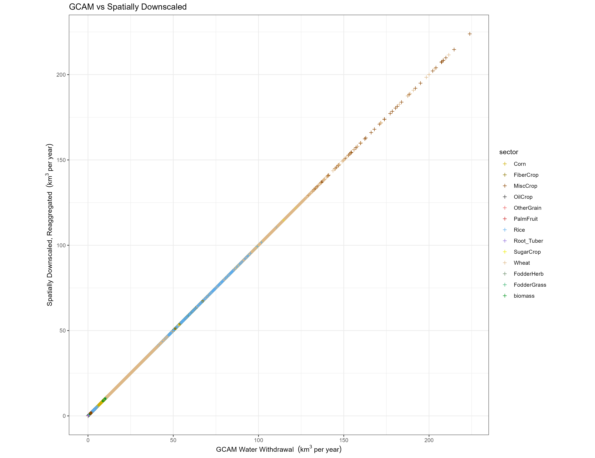

<!-- Allow href to tabsets --> 
```{js, echo=FALSE}
function goToTab() {
  var hash = String(window.location.href.match("#.*$"));
  var target = document.querySelector("a[role = 'tab'][href='" + hash + "']");
  if (target !== null) {
    var greatgrandparent = target.parentElement.parentElement.parentElement;
    if (greatgrandparent.getAttribute("role") == "tabpanel") {
      document.querySelector("a[role = 'tab'][href='#" + greatgrandparent.getAttribute("id") + "']").click();
    }
    target.click();
    target.scrollIntoView();
  }
}

window.onload = function() {
  setTimeout(goToTab, 100);
}

window.onhashchange = goToTab;
```

<div class="header_logo">

</div>

<!-------------------------->
<!-------------------------->
# Citation
<!-------------------------->
<!-------------------------->
<p align="center"> </p>

Khan, Z., Thompson, I., Vernon, C., Graham, N., Wild, T.B., Chen, M., 2022. A global gridded monthly water withdrawal dataset for multiple sectors from 2015 to 2100 at 0.5° resolution under a range of socioeconomic and climate scenarios. (In progress) Journal_TBD, DOI: XXXX

<br>

<!-------------------------->
<!-------------------------->
# Models Used
<!-------------------------->
<!-------------------------->
<p align="center"> </p>

```{r, results = 'show', eval=TRUE, echo=FALSE, warning=FALSE, error = FALSE, message = FALSE}
library(kableExtra)
data.frame(
    Model = c("Tethys"),
    Version = c("v1.3.0"),
    Description = c("Spatiotemporal downscaling model for global water use"),
    Language = c("Python"),
    Link = c("https://jgcri.github.io/tethys/")
    ) %>% 
  kbl() %>%
  kable_styling(bootstrap_options = c("striped", "hover", "condensed", "responsive"))
```

<br>

<!-------------------------->
<!-------------------------->
# Data Inputs
<!-------------------------->
<!-------------------------->
<p align="center"> </p>

```{r, results = 'show', eval=TRUE, echo=FALSE, warning=FALSE, error = FALSE, message = FALSE}
library(kableExtra)
data.frame(
  Data = c("GCAM Outputs",
           "Demeter Outputs"),
  Source = c("GCAM runs",
             "Demeter runs"),
  `Used by` = c("Tethys",
                "Tethys"),
  Location = c("https://data.pnnl.gov/dataset/13224",
               "https://data.pnnl.gov/dataset/13192")
    ) %>% 
  kbl() %>%
  kable_styling(bootstrap_options = c("striped", "hover", "condensed", "responsive"))
```

<br>

<!-------------------------->
<!-------------------------->
# Data Outputs
<!-------------------------->
<!-------------------------->
<p align="center"> </p>

```{r, results = 'show', eval=TRUE, echo=FALSE, warning=FALSE, error = FALSE, message = FALSE}
library(kableExtra)
data.frame(
  Data = c("Tethys Outputs"),
  Source = c("Tethys runs"),
  `Used by` = c(""),
  Location = c("zenodo link")
    ) %>% 
  kbl() %>%
  kable_styling(bootstrap_options = c("striped", "hover", "condensed", "responsive"))
```

<br>

<!-------------------------->
<!-------------------------->
# Workflows
<!-------------------------->
<!-------------------------->
<p align="center"> </p>

```{r, echo=FALSE, out.width="40%", fig.align='center', fig.cap="Workflow Summary"}
knitr::include_graphics("images/workflow_summary.jpg")
```

<br>

<!-------------------------->
<!-------------------------->
# Workflow 1 - Scenarios
<!-------------------------->
<!-------------------------->
<p align="center"> </p>

This dataset contains water withdrawal projections under a range of socioeconomic and climate scenarios. Combinations of five Shared Socioeconomic Pathways (SSPs 1-5) and four Representative Concentration Pathways (RCPs 2.6, 4.5, 6, and 8.5) are used. However, RCP 2.6 is not considered possible under SSP 3, and RCP 8.5 is only considered possible for SSP 5. This leaves 15 valid SSP-RCP combinations, shown in the diagram below.

```{r, echo=FALSE, out.width="100%", fig.align='center', fig.cap="Workflow 1"}
knitr::include_graphics("images/workflow1.jpg")
```

For each valid SSP-RCP combination, five General Circulation Models (GCMs) are used. This gives a grand total of 75 SSP-RCP-GCM combinations, which are fed into GCAM.

<br>

<!-------------------------->
<!-------------------------->
# Workflow 2 - Model Runs
<!-------------------------->
<!-------------------------->
<p align="center"> </p>

GCAM is run for each SSP-RCP-GCM combination. The GCAM outputs are at the resolution of 32 geopolitical regions, and 235 water basins, with 5-year timesteps. The sectoral water withdrawal outputs from GCAM are the primary inputs to Tethys, which will be downscaled to the target resolution. Crop outputs from GCAM are sent to Demeter for downscaling, to be used by Tethys for the irrigation sector.

```{r, echo=FALSE, out.width="100%", fig.align='center', fig.cap="Workflow 2"}
knitr::include_graphics("images/workflow2.jpg")
```

<br>

<!-------------------------->
<!-------------------------->
# Workflow 3 - Spatial Downscaling
<!-------------------------->
<!-------------------------->
<p align="center"> </p>

Withdrawal data for each sector is downscaled spatially first, from 32 regions or 235 basins to 0.5 degree grids. Of the 259,200 possible grid cells at this resolution (360 x 720), only the 67,420 cells categorized as land are considered (since nobody is withdrawing water from the bottom of the ocean).

```{r, echo=FALSE, out.width="100%", fig.align='center', fig.cap="Workflow 3"}
knitr::include_graphics("images/workflow3.jpg")
```


```{r, echo=FALSE, out.width="100%", fig.align='center', fig.cap="Spatial Workflow"}
knitr::include_graphics("images/spatialworkflow.png")
```

Different downscaling methods are used for different sectors. For spatial downscaling, the workflow is divided into three parts:

* A. Nonagricultural Sectors
* B. Livestock
* C. Irrigation

<br>

<!-------------------------->
## Workflow 3A - Nonagricultural Sectors
<!-------------------------->

For nonagricultural sectors (domestic, electricity, manufacturing, and mining), water withdrawal in each grid cell is assumed to be proportional to that cell’s population.
(equation, supporting files, function name)

<br>

<!-------------------------->
## Workflow 3B - Livestock
<!-------------------------->

Gridded global maps of livestock in six types (cattle, buffalo, sheep, goats, pigs and poultry) are used as a proxy to downscale livestock water withdrawal.

<br>

<!-------------------------->
## Workflow 3C - Irrigation
<!-------------------------->

Spatial landcover outputs from Demeter are reaggregated to the target resolution. For each region-basin intersection, and each crop type (except for biomass), the water withdrawal from GCAM is allocated to the constituent grids in proportion to the ratio from Demeter. Biomass is distributed uniformly.

<br>

<!-------------------------->
<!-------------------------->
# Workflow 4 - Temporal Downscaling
<!-------------------------->
<!-------------------------->
<p align="center"> </p>

At this stage the data has been downscaled spatially to 0.5 degree grids, but is still in 5 year timesteps. First, linear interpolation is applied to produce annual data. Then, downscaling algorithms are applied to each sector to produce monthly data with seasonal variation.

```{r, echo=FALSE, out.width="100%", fig.align='center', fig.cap="Workflow 4"}
knitr::include_graphics("images/workflow4.jpg")
```

```{r, echo=FALSE, out.width="100%", fig.align='center', fig.cap="Temporal Workflow"}
knitr::include_graphics("images/temporalworkflow.png")
```

For spatial downscaling, the workflow is divided into four parts:

* A. Livestock, Manufacturing, and Mining
* B. Domestic
* C. Electricity Generation
* D. Irrigation


<!-------------------------->
## Workflow 4A - Livestock, Manufacturing, and Mining
<!-------------------------->

For livestock, manufacturing, and mining, a uniform distribution is applied. The withdrawal for the year is divided between months according to the number of days.

<br>

<!-------------------------->
## Workflow 4B - Domestic
<!-------------------------->

Temporally downscaling domestic withdrawal is based on monthly average temperatures, and the relative withdrawals between warmest and coolest months.

<br>

<!-------------------------->
## Workflow 4C - Electricity Generation
<!-------------------------->

Assume water use is proportional to electricity generated. Formula based on HDD, CDD.

<br>

<!-------------------------->
## Workflow 4D - Irrigation
<!-------------------------->

Monthly weighted irrigation profiles based on region and crop type.

<br>

<!-------------------------->
<!-------------------------->
# Workflow 5 - Results 
<!-------------------------->
<!-------------------------->
<p align="center"> </p>

<!-------------------------->
## Annual {.tabset}
<!-------------------------->

### Total
```{r, echo=FALSE, out.width="100%", fig.align='center', fig.cap="Total Annual Water Withdrawal by SSP-RCP-GCM"}
knitr::include_graphics("images/figure1.png")
```

### By Sector
```{r, echo=FALSE, out.width="100%", fig.align='center', fig.cap="Global Annual Water Withdrawal by SSP-RCP-GCM and Sector"}
knitr::include_graphics("images/figure2.png")
```

### Crops
```{r, echo=FALSE, out.width="100%", fig.align='center', fig.cap="Global Annual Water Withdrawal by SSP-RCP-GCM and Sector"}
knitr::include_graphics("images/figure6.png")
```

### GCMs {.tabset .tabset-pills}

#### GFDL
```{r, echo=FALSE, out.width="100%", fig.align='center', fig.cap="Global Annual Water Withdrawal by SSP-RCP-Sector, GCM: gfdl"}
knitr::include_graphics("images/figure3a.png")
```

#### HADGEM
```{r, echo=FALSE, out.width="100%", fig.align='center', fig.cap="TGlobal Annual Water Withdrawal by SSP-RCP-Sector, GCM: hadgem"}
knitr::include_graphics("images/figure3b.png")
```

#### IPSL
```{r, echo=FALSE, out.width="100%", fig.align='center', fig.cap="Global Annual Water Withdrawal by SSP-RCP-Sector, GCM: ipsl"}
knitr::include_graphics("images/figure3c.png")
```

#### MIROC
```{r, echo=FALSE, out.width="100%", fig.align='center', fig.cap="Global Annual Water Withdrawal by SSP-RCP-Sector, GCM: miroc"}
knitr::include_graphics("images/figure3d.png")
```

#### NORESM
```{r, echo=FALSE, out.width="100%", fig.align='center', fig.cap="Global Annual Water Withdrawal by SSP-RCP-Sector, GCM: noresm"}
knitr::include_graphics("images/figure3e.png")
```

<!-------------------------->
## Monthly {.tabset}
<!-------------------------->

### All Sectors
```{r, echo=FALSE, out.width="100%", fig.align='center', fig.cap="Monthly Example"}
knitr::include_graphics("images/figure4a.png")
```

### No Irrigation
```{r, echo=FALSE, out.width="100%", fig.align='center', fig.cap="Without Irrigation"}
knitr::include_graphics("images/figure4b.png")
```

### Crops
```{r, echo=FALSE, out.width="100%", fig.align='center', fig.cap="Without Irrigation"}

```

<!-------------------------->
## Maps {.tabset}
<!-------------------------->
```{r, echo=FALSE, out.width="100%", fig.align='center'}
knitr::include_graphics("images/facetmapannual.png")
```
```{r, echo=FALSE, out.width="100%", fig.align='center'}
knitr::include_graphics("images/facetmapmonthly.png")
```

<br>

<!-------------------------->
<!-------------------------->
# Validation
<!-------------------------->
<!-------------------------->
<p align="center"> </p>

<!-------------------------->
## Spatial {.tabset}
<!-------------------------->

### Sectors
```{r, echo=FALSE, out.width="75%", fig.align='center', fig.cap="GCAM inputs vs grids Reaggregated"}
knitr::include_graphics("images/validation1.png")
```

### Crops
```{r, echo=FALSE, out.width="75%", fig.align='center', fig.cap="GCAM inputs vs grids Reaggregated"}

```


<!-------------------------->
## Temporal {.tabset}
<!-------------------------->

### Sectors
```{r, echo=FALSE, out.width="75%", fig.align='center', fig.cap="Annual vs Reaggregated Monthly"}
knitr::include_graphics("images/validation3.png")
```

### Crops
```{r, echo=FALSE, out.width="75%", fig.align='center', fig.cap="Annual vs Reaggregated Monthly"}

```

# Basin Examples
We have selected the following regions from literature to explore in more detail, as a way of showing the full resolution of this data set.
```{r, echo=FALSE, out.width="100%", fig.align='center', fig.cap="Selected Regions"}
knitr::include_graphics("images/overview_map.png")
```

## Indus

<!-------------------------->
### Withdrawals by Sector {.tabset}
<!-------------------------->

```{r, echo=FALSE, results = 'asis'}
for(sector in c("total", "dom", "elec", "mfg", "min", "liv", "irr")){
  cat("\n####", sector, "{.tabset .tabset-pills}\n")
  for(scenario in c("ssp1_rcp26_gfdl", "ssp2_rcp45_hadgem", "ssp3_rcp60_ipsl", "ssp4_rcp45_miroc", "ssp5_rcp85_noresm")){
    cat("\n#####", scenario, "\n")
    cat("", sep="")
    cat("", sep="")
    cat('\n')
  }
}
```

<!-------------------------->
### Withdrawals by Crop {.tabset}
<!-------------------------->
```{r, echo=FALSE, results = 'asis'}
for(sector in c("Corn", "FiberCrop", "MiscCrop", "OilCrop", "OtherGrain", "Rice", "Root_Tuber", "SugarCrop", "Wheat")){
  cat("\n####", sector, "{.tabset .tabset-pills}\n")
  for(scenario in c("ssp1_rcp26_gfdl", "ssp2_rcp45_hadgem", "ssp3_rcp60_ipsl", "ssp4_rcp45_miroc", "ssp5_rcp85_noresm")){
    cat("\n#####", scenario, "\n")
    cat("", sep="")
    cat("", sep="")
    cat('\n')
  }
}
```

## Nile

<!-------------------------->
### Withdrawals by Sector {.tabset}
<!-------------------------->

```{r, echo=FALSE, results = 'asis'}
for(sector in c("total", "dom", "elec", "mfg", "min", "liv", "irr")){
  cat("\n####", sector, "{.tabset .tabset-pills}\n")
  for(scenario in c("ssp1_rcp26_gfdl", "ssp2_rcp45_hadgem", "ssp3_rcp60_ipsl", "ssp4_rcp45_miroc", "ssp5_rcp85_noresm")){
    cat("\n#####", scenario, "\n")
    cat("", sep="")
    cat("", sep="")
    cat('\n')
  }
}
```

<!-------------------------->
### Withdrawals by Crop {.tabset}
<!-------------------------->
```{r, echo=FALSE, results = 'asis'}
for(sector in c("Corn", "FiberCrop", "FodderHerb", "MiscCrop", "OilCrop", "OtherGrain", "Rice", "Root_Tuber", "SugarCrop", "Wheat")){
  cat("\n####", sector, "{.tabset .tabset-pills}\n")
  for(scenario in c("ssp1_rcp26_gfdl", "ssp2_rcp45_hadgem", "ssp3_rcp60_ipsl", "ssp4_rcp45_miroc", "ssp5_rcp85_noresm")){
    cat("\n#####", scenario, "\n")
    cat("", sep="")
    cat("", sep="")
    cat('\n')
  }
}
```

## Colorado

<!-------------------------->
### Withdrawals by Sector {.tabset}
<!-------------------------->

```{r, echo=FALSE, results = 'asis'}
for(sector in c("total", "dom", "elec", "mfg", "min", "liv", "irr")){
  cat("\n####", sector, "{.tabset .tabset-pills}\n")
  for(scenario in c("ssp1_rcp26_gfdl", "ssp2_rcp45_hadgem", "ssp3_rcp60_ipsl", "ssp4_rcp45_miroc", "ssp5_rcp85_noresm")){
    cat("\n#####", scenario, "\n")
    cat("", sep="")
    cat("", sep="")
    cat('\n')
  }
}
```

<!-------------------------->
### Withdrawals by Crop {.tabset}
<!-------------------------->
```{r, echo=FALSE, results = 'asis'}
for(sector in c("Corn", "FodderHerb", "MiscCrop", "OilCrop", "OtherGrain", "Root_Tuber", "SugarCrop", "Wheat")){
  cat("\n####", sector, "{.tabset .tabset-pills}\n")
  for(scenario in c("ssp1_rcp26_gfdl", "ssp2_rcp45_hadgem", "ssp3_rcp60_ipsl", "ssp4_rcp45_miroc", "ssp5_rcp85_noresm")){
    cat("\n#####", scenario, "\n")
    cat("", sep="")
    cat("", sep="")
    cat('\n')
  }
}
```

